## Deployment
**So you want to deploy the entire stack yourself? You've come to the right place.**  

> [!NOTE]
> This guide is primarily written to facilitate deployment from Linux machines, but the vast majority of the things done here should translate 1-to-1 to Windows as well

Now, there are some prerequisites you would want to get sorted out before we begin:  
- `git` is installed and accessible from your terminal
  - To download it, head over to https://git-scm.com/downloads
- Docker Engine is installed and you have access to `docker` and `docker compose` commands from your terminal
  - You can see a detailed guide on how to install the Docker Engine here: https://docs.docker.com/engine/install/.
  - Likewise, for `docker compose` you can see the guide here: https://docs.docker.com/compose/install/.
- A [GitHub](https://github.com/) account (and optionally a second one as well, see the [Creating a GitHub Repository](#creating-a-github-repository) section for when you'd want this)
  - This is important because part of the stack is entirely based on GitHub and the setup requires that you create a GitHub app and host a repository on GitHub. This might be one of the first of your clues on how this project fits the "wrong tool for the job" theme.
  - You must also set up either HTTPS or SSH authentication (I personally would suggest SSH) for GitHub: https://docs.github.com/en/authentication/keeping-your-account-and-data-secure/about-authentication-to-github#authenticating-with-the-command-line

Alright, got that sorted out? Great, let's move on to the next steps.

### Creating a GitHub repository

There are two approaches you can use to achieve this, the simplest and fastest way would be to simply fork this repository, however, if you choose this approach, you will need another account to test the "database" aspect of this project. The other approach is to clone it locally, create an empty repository on GitHub and push the local clone to this newly created GitHub repository.

> [!IMPORTANT]
> If you choose to **fork**, you **must** have another (either personal or organizational) account if you want to test the deployment out, because you will need to create a fork of your fork to establish the "database"

---

<details>
<summary><b>Creating a new, unassociated repository</b></summary>

<details>
    <summary>1. Click on the <b>+</b> button in the top right corner of the page anywhere on the GitHub site</summary>
    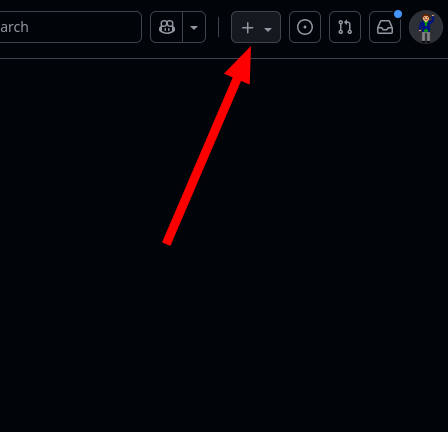
</details>

<details>
    <summary>2. Click the <b>New repository</b> button</summary>
    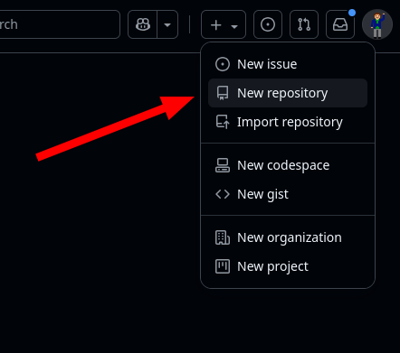
</details>

<details>
    <summary>3. Pick a name for the repository, leave all the settings to their defaults, click <b>Create repository</b></summary>
    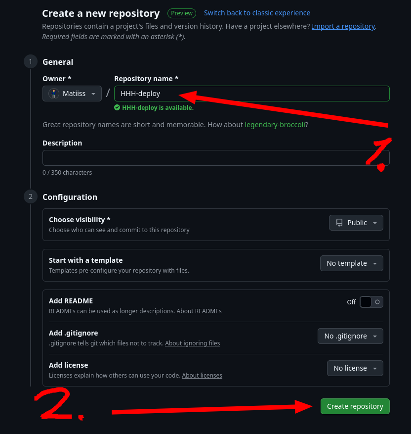
</details>

<details>
    <summary>4. Open your terminal, clone <a href="https://github.com/heavenly-hostas-hosting/HHH">https://github.com/heavenly-hostas-hosting/HHH</a> locally, and <code>cd</code> into the created directory</summary>
    <pre><code>
git clone https://github.com/heavenly-hostas-hosting/HHH
cd ./HHH
    </code></pre>
</details>

<details>
    <summary>5. While in the same terminal, remove the <code>origin</code> remote</summary>
    <pre><code>
git remote remove origin
    </code></pre>
    If you get an error along the lines of the remote not existing, first list all your remotes, then remove the one (should be only one) that you see
    <pre><code>
git remote  # for example, this outputs 'upstream', then you'd do the following
git remote remove upstream
    </code></pre>
</details>

<details>
    <summary>6. Go to <i>your</i> newly created repository from step <b>3</b>, select HTTPS or SSH depending on which one you have set up for your account (personally I would suggest using SSH), copy the <i>…or push an existing repository from the command line</i> command and paste and run it in your terminal</summary>
    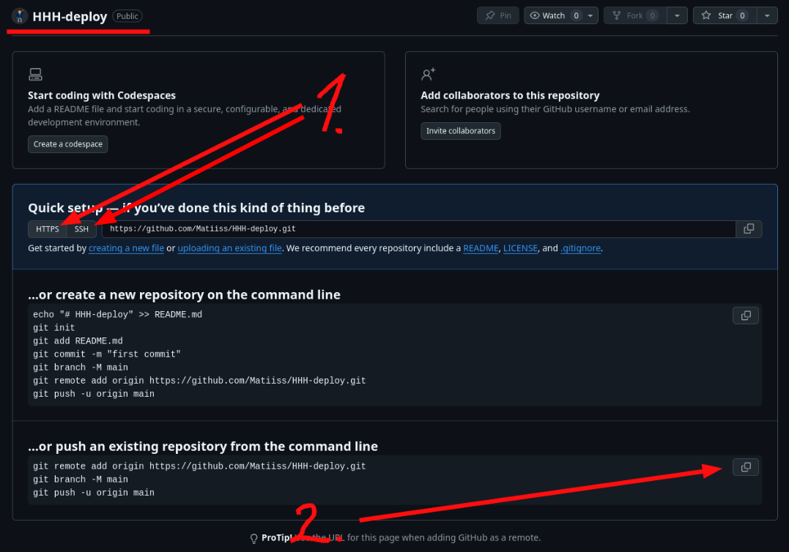
</details>

</details>

---

<details>
<summary><b>Forking this repository</b></summary>

There can exist two states of being for this step, you have either already forked this repository or you have not... Apparently (finding out as I'm writing this guide), GitHub does not let you create multiple forks of the same repository on the same account. So really your options in this case are either to pick another account to create the fork on if you want to separate this deployment from your potential artwork storage or you can use your already existing fork.

---

<details>
<summary>Already have a fork of this repository and want to use it for deployment? Expand this section</summary>
Feels pretty empty, doesn't it?
<br>
Just head over to your forked repository, that's all :)
<br><br>
If you do still need more detailed instructions:

<details>
    <summary>1. Go to our GitHub repository: <a href="https://github.com/heavenly-hostas-hosting/HHH">https://github.com/heavenly-hostas-hosting/HHH</a></summary>
    You're probably already here :), but do head over to the main page (for example, by following the link given above) to be able to follow the next steps exactly.
</details>

<details>
    <summary>2. Click the downwards facing triangle (it looks about like this: <code>\/</code>) next to the <b>Fork</b> button and then click on your forked repository</summary>
    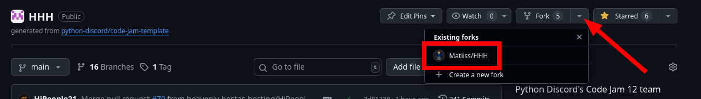
</details>

</details>

---

<details>
<summary>Haven't forked this repository yet or want to fork it with a different account? This is your dropdown</summary>
<details>
    <summary>1. Go to our GitHub repository: <a href="https://github.com/heavenly-hostas-hosting/HHH">https://github.com/heavenly-hostas-hosting/HHH</a></summary>
    You're probably already here :), but do head over to the main page (for example, by following the link given above) to be able to follow the next steps exactly.
</details>

<details>
    <summary>2. Click the <b>Fork</b> button at the top, it's right next to the <b>Star</b> button, and while you're at it, click that one as well :P</summary>
    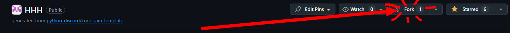
</details>

<details>
    <summary>3. Pick a name for your fork (and an account if necessary) or leave it as the default and click on <b>Create fork</b></summary>
    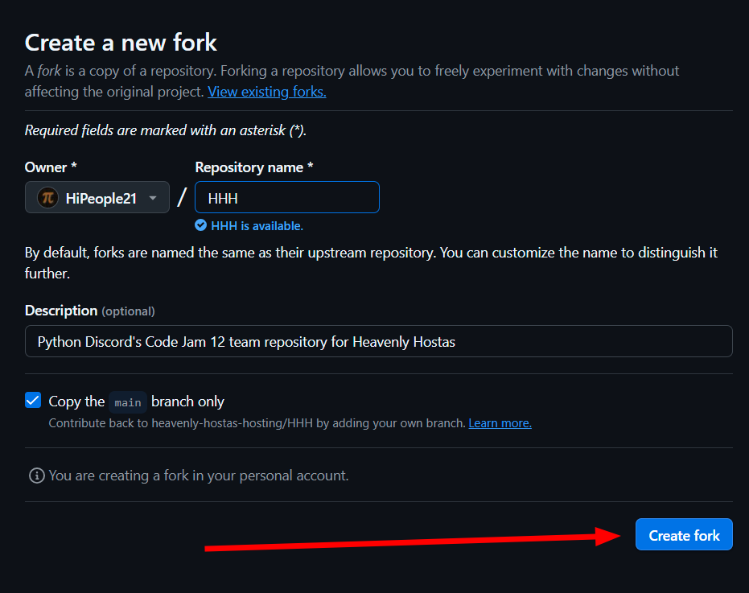
</details>
</details>

---

Finally you're going to want to clone the forked repository locally:

<details>
    <summary>1. Go to <i>your</i> fork and click on <b><> Code</b></summary>
    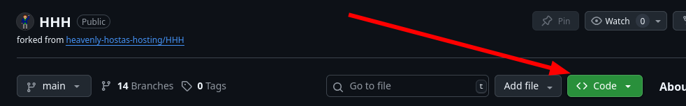
</details>

<details>
    <summary>2. Select either HTTPS or SSH tab depending on which method you have set up for authentication for your GitHub account (personally I would suggest using SSH), then copy the URL</summary>
    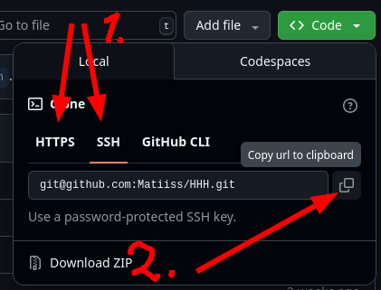
</details>

<details>
    <summary>3. In your terminal, clone the repository whose URL you just copied and <code>cd</code> into its directory</summary>
    <pre><code>
git clone &lt;paste your url here&gt; ./HHH  # <- this picks the destination directory of the repository, you can pick a different one if you want, but take that into account for the next command
cd ./HHH
    </code></pre>
</details>

</details>

---

### Creating a GitHub App
For a more detailed overview take a loot at GitHub's own guide for Apps: https://docs.github.com/en/apps/overview

<details>
    <summary>1. Click on your profile picture in the top right corner of the page anywhere on the GitHub site</summary>
    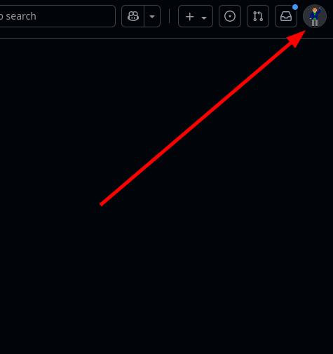
</details>

<details>
    <summary>2. Go to <b>Settings</b></summary>
    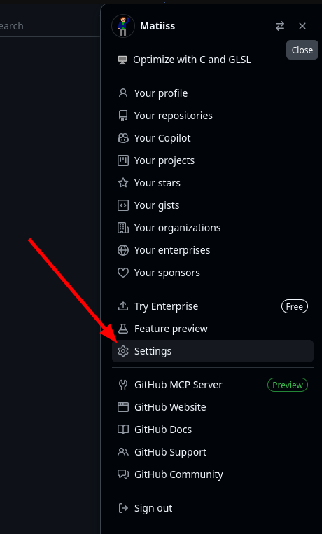
</details>

<details>
    <summary>3. Go to <b>Developer Settings</b></summary>
    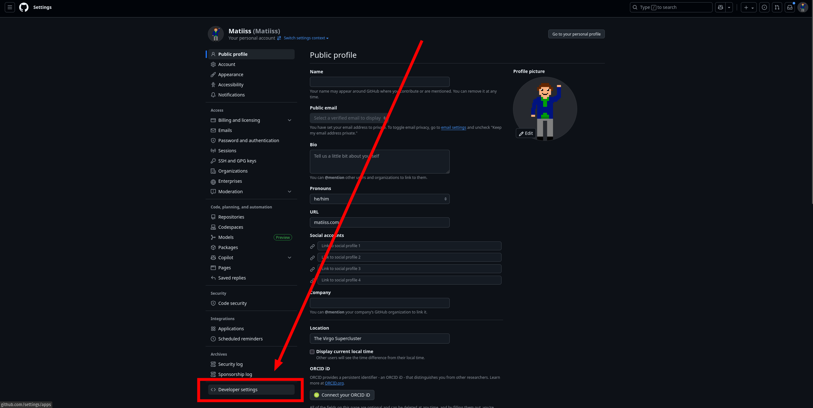
</details>

<details>
    <summary>4. Click on <b>New GitHub App</b></summary>
    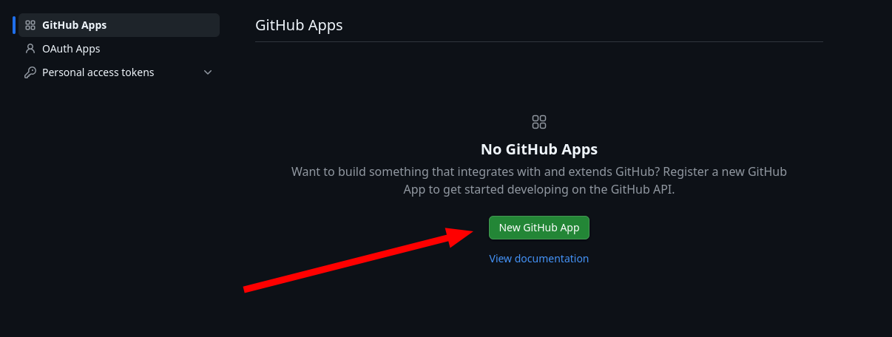
</details>

<details>
    <summary>5. Set <b>GitHub App name</b> to something like <code>pydis-cj12-HHH-deploy-&lt;your-github-username&gt;</code>, <b>Homepage URL</b> can just be your repository URL, set <b>Callback URL</b> to <code>http://localhost/api/kong/auth/v1/callback</code> and make sure to tick the <b>OAuth</b> box</summary>
    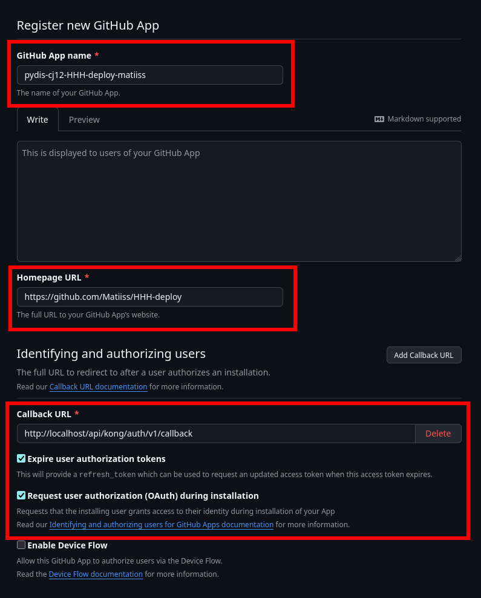
</details>

<details>
    <summary>6. Disable webhooks</summary>
    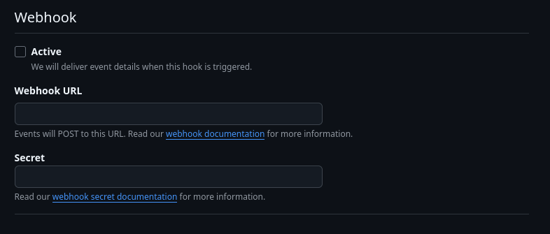
</details>

<details>
    <summary>7. Set <b>Repository permissions</b> to <b>Contents: Read and write</b>, <b>Pull requests: Read and write</b>, and <b>Account permissions</b> to <b>Email addresses: Read-only</b></summary>
    <br>
    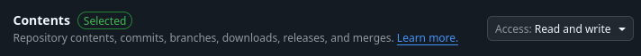<br>
    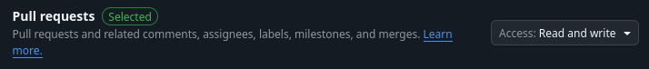<br>
    <br>
    <br>
</details>

<details>
    <summary>8. Allow app to be installed on any account and click <b>Create GitHub App</b></summary>
    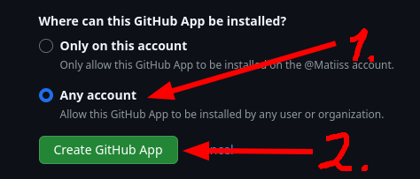
</details>

<details>
    <summary>9. <b>Generate a new client secret</b>, store it somewhere safe, will be needed later on, then scroll down and <b>Generate a private key</b>, make sure to save it with the name <code>pydis-cj12-heavenly-hostas-app.private-key.pem</code> and store it inside the <code>packages/backend</code> directory</summary>
    <br>
    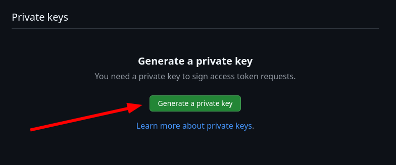<br>
</details>

<details>
    <summary>10. Make sure to <b>Save changes</b></summary>
    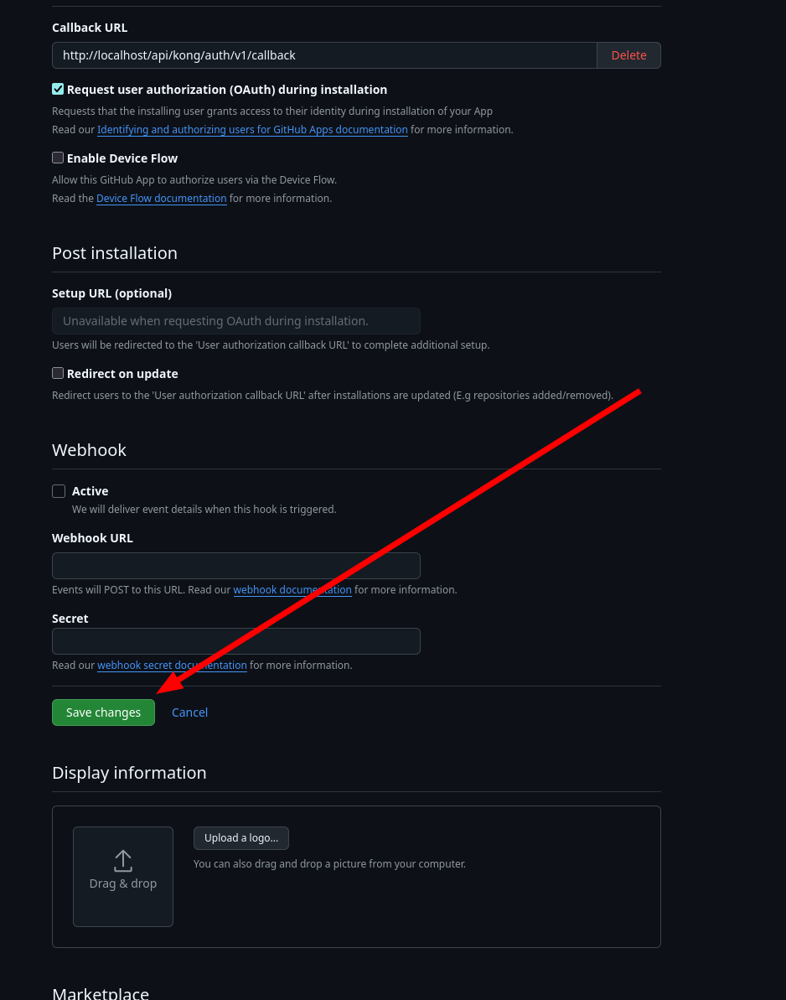
</details>

<br>

Lastly go to your GitHub App's public URL and install it on your main deployment repository (it might seem like it fails because it can't find `localhost`, but it will install itself on the repository, do make sure to only install it on the deployment repo and not all of your repositories)


### Creating a `data` branch
In your terminal, go to your local repository and create a new branch and add the data workflow to it
```
git switch --orphan data
git checkout main -- .github/workflows/data.yaml
```
Now, if you're on Linux, you can use the following command to replace the string `cj12.matiiss.com` with the string `${{ vars.DATA_API_HOST }}`, otherwise you can just use any text editor you'd like (preferrably one with Find & Replace functionality) to do the same
```
sed 's/cj12.matiiss.com/\$\{\{ vars.DATA_API_HOST \}\}/g' .github/workflows/data.yaml > tmp.yaml && mv tmp.yaml .github/workflows/data.yaml
```

Next, just add, commit, and push the changes to GitHub and then switch back to the main branch
```
git add .github/workflows/data.yaml
git commit -m "Change hard-coded URL to a workflow variable"
git push -u origin HEAD
git switch main
```

Now you need to learn how to set GitHub Actions variables

<details>
    <summary>1. Go to your repository's <b>Settings</b></summary>
    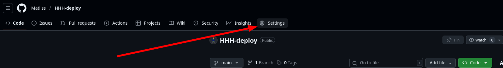
</details>

<details>
    <summary>2. Go to <b>Secrets and variables</b> &gt; <b>Actions</b></summary>
    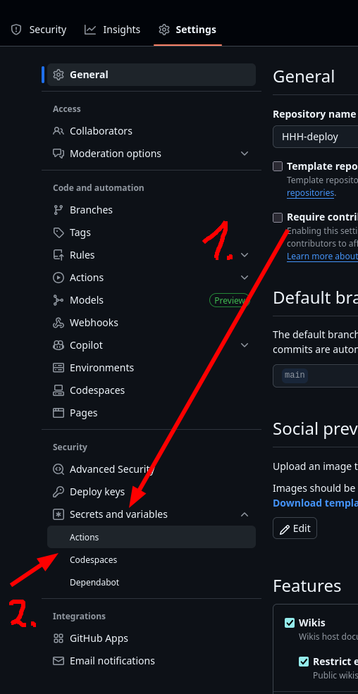
</details>

<details>
    <summary>3. Create a <b>New repository variable</b></summary>
    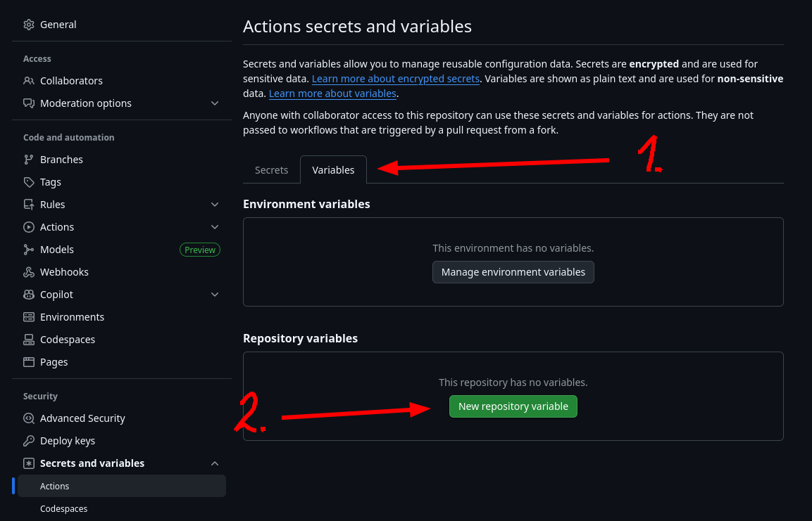
</details>

<details>
    <summary>4. Name it <code>DATA_API_HOST</code> and add some filler value as its value for now</summary>
    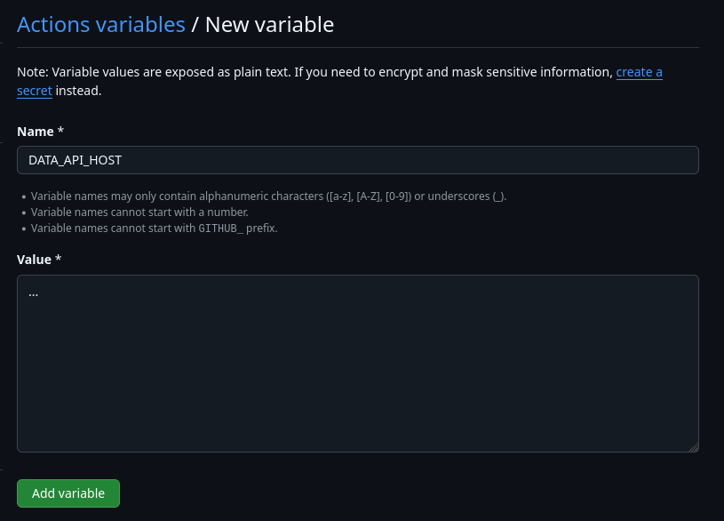
</details>


### Set up and deploy GitHub Pages
For a more detailed overview of what GitHub Pages are see https://pages.github.com/

<details>
    <summary>1. Go to your repository's <b>Settings</b></summary>
    
</details>

<details>
    <summary>2. Go to <b>Pages</b></summary>
    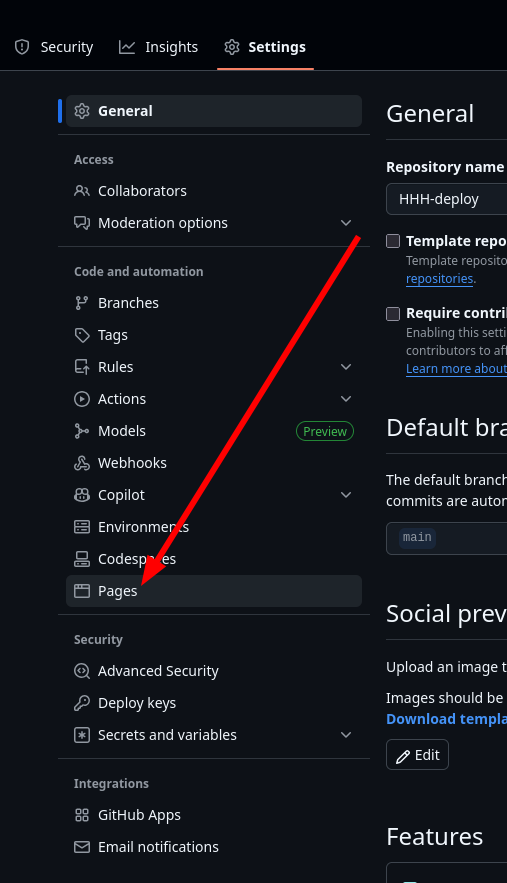
</details>

<details>
    <summary>3. Change <b>Source</b> to deploy from <b>GitHub Actions</b></summary>
    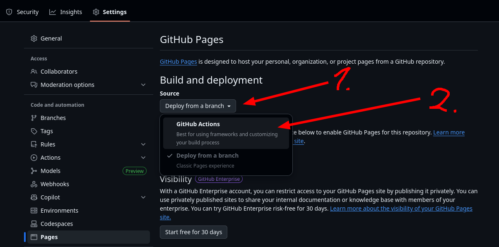
</details>

<details>
    <summary>4. Go back to your repository's main page and navigate to <code>packages/gallery/main.py</code></summary>
    <ol>
        <li>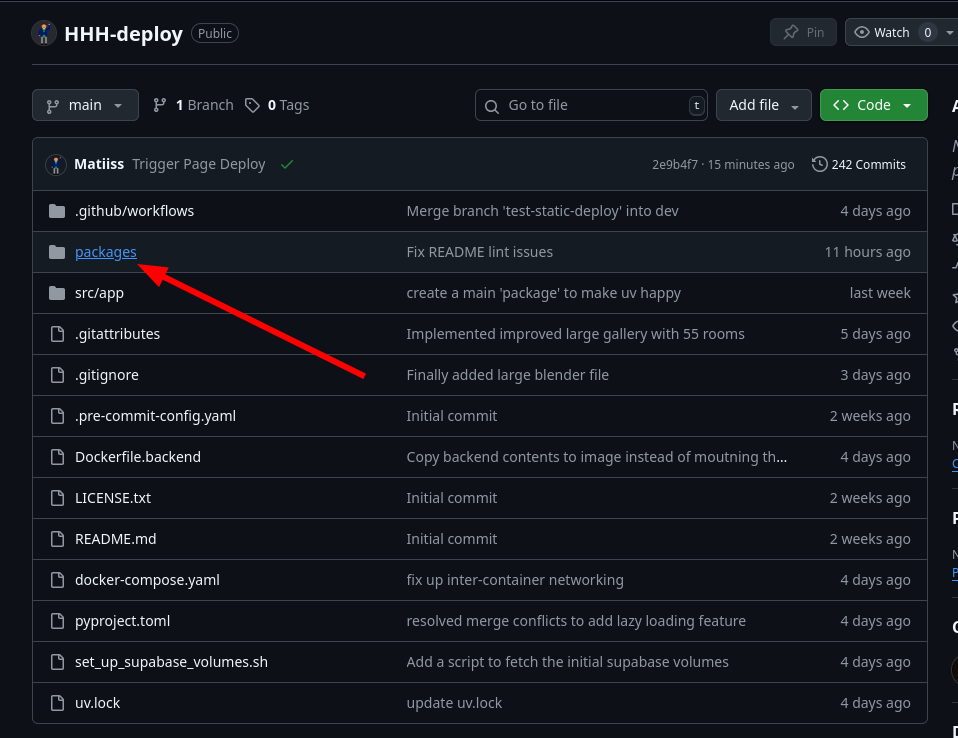</li>
        <li>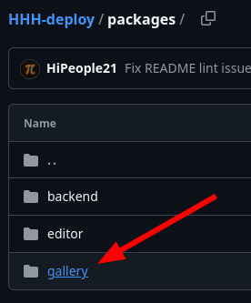</li>
        <li>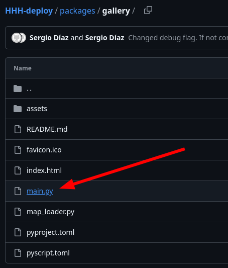</li>
    </ol>
</details>

<details>
    <summary>5. Enter file edit mode for <code>packages/gallery/main.py</code></summary>
    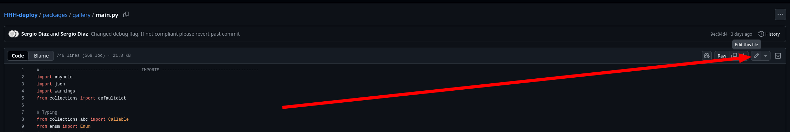
</details>

<details>
    <summary>6. Find where <code>REPO_URL</code> is defined and change <code>heavenly-hostas-hosting/HHH</code> to <code>&lt;your-username&gt;/&lt;your-repo-name&gt;</code></summary>
    For example, from:
    <br>
    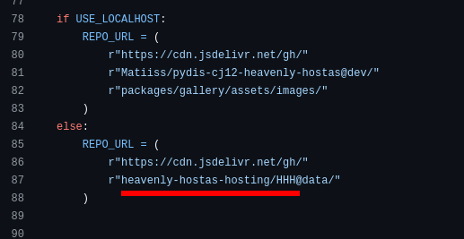
    <br>
    to:
    <br>
    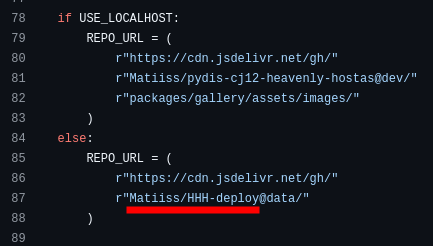
</details>

<details>
    <summary>7. Find <code>cj12.matiiss.com</code> and replace it with <code>localhost</code></summary>
    From:
    <br>
    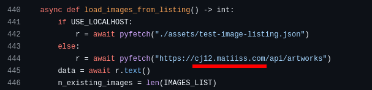
    <br>
    to:
    <br>
    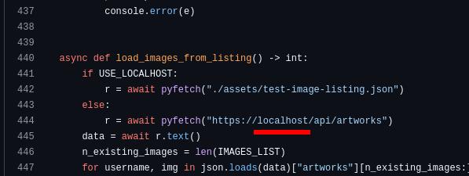
</details>

<details>
    <summary>8. Commit your changes</summary>
    <ol>
        <li>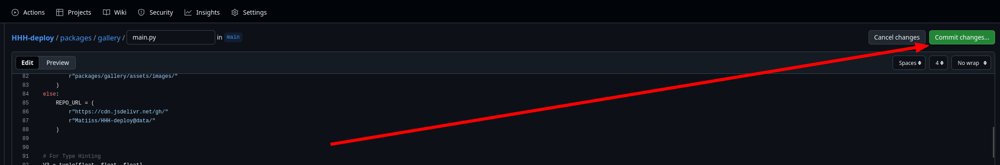</li>
        <li>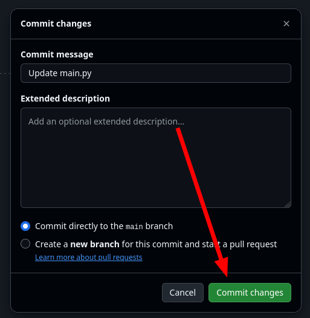</li>
    </ol>
</details>

<details>
    <summary>9. Go back to your repository's main page and navigate to <code>packages/gallery/assets/editor.html</code></summary>
    <ol>
        <li></li>
        <li></li>
        <li>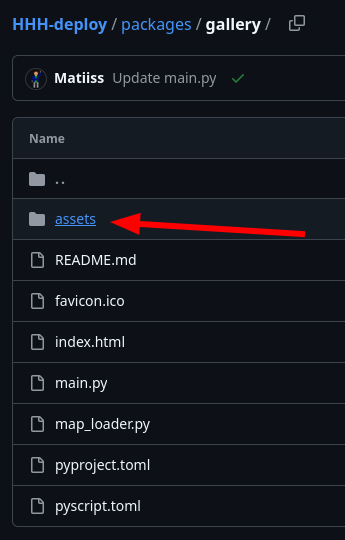</li>
        <li>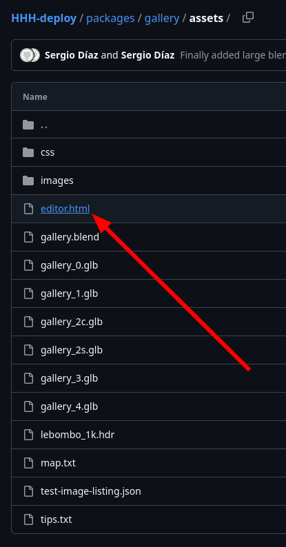</li>
    </ol>
</details>

<details>
    <summary>10. Enter file edit mode for <code>packages/gallery/assets/editor.html</code></summary>
    
</details>

<details>
    <summary>11. Replace all instances of <code>cj12.matiiss.com</code> with <code>localhost</code></summary>
    From:
    <br>
    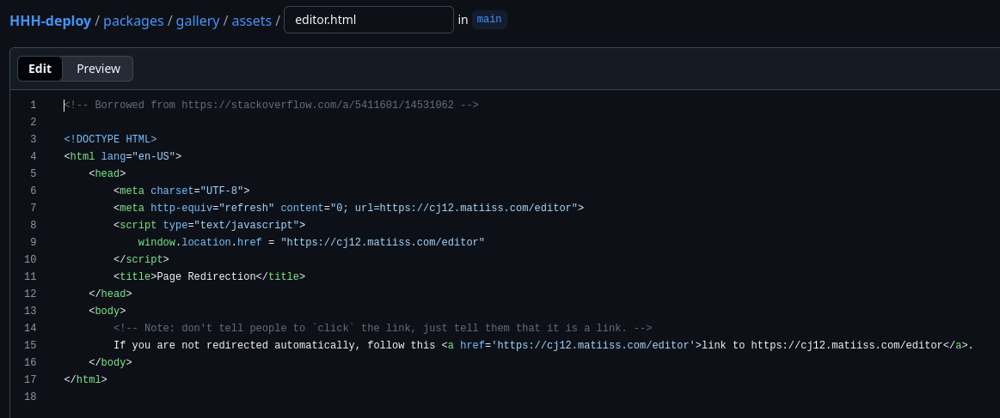
    <br>
    to:
    <br>
    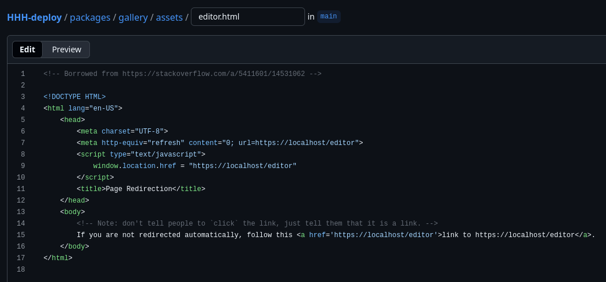
</details>

<details>
    <summary>12. Commit your changes</summary>
    <ol>
        <li></li>
        <li></li>
    </ol>
</details>


### Local setup
You need to set up the initial volumes for supabase and to do that there's a convenience script, so just run that
```
bash ./set_up_supabase_volumes.sh
```

Then afterwards you want to copy the `.env.template` from the backend and link it to project root
```
cp packages/backend/.env.template packages/backend/.env
ln packages/backend/.env .env
```

Open up the `.env` file in a text editor and adjust the environment variables as necessary:
- `CLIENT_ID` is your GitHub App's client ID
- `CLIENT_SECRET` is the secret your generated for your GitHub App
- `GIT_UPSTREAM_*` refers to your deployment repository, the first commit hash you can get from GitHub or git for the `data` branch by looking at the history/logs. The app installation ID you can see in the URL in your browser when you visit your installation.
- Regarding supabase variables, they have a generator for those: https://supabase.com/docs/guides/self-hosting/docker#generate-api-keys
- `GOTRUE_EXTERNAL_GITHUB_REDIRECT_URI="http://localhost/api/kong/auth/v1/callback"`
- `GITHUB_CALLBACK_REDIRECT_URI="http://localhost/api/auth"`
- `POST_AUTH_REDIRECT_URI="https://localhost/editor"`


### 3-2-1 Lift-off!
First, let's connect to the internet so that the GitHub workflow can access our API for PR verification, we'll do this using https://localhost.run/ which will provide us with a free, temporary, public domain name.
```
ssh -R 80:localhost:8080 localhost.run
```

Now export `PUBLIC_HOST` with the value of the domain name that you got from `localhost.run` but remove the protocol or any paths (e.g., https://abcd.def.foo -> abcd.def.foo)

```
export PUBLIC_HOST=...
```
And navigate over to your GitHub repository and set that domain name as the value for the `DATA_API_HOST` repository variable as well.

Before we run any `docker` container, we must first create a shared network for some of the `docker compose` services to communicate with `nginx` and vice versa
```
docker network create shared-net
```

It's now time to spin up the entire stack
```
docker compose up -d
```

Finally let's spin up `nginx` for traffic routing
```bash
NETWORK=shared-net TMP_DIR=$(mktemp -d) && \
openssl req -x509 -nodes -days 365 -newkey rsa:2048 -keyout "$TMP_DIR/key.pem" -out "$TMP_DIR/cert.pem" -subj "/CN=localhost" && \
cat > "$TMP_DIR/nginx.conf" <<'EOF'
events {}
http {
    server { listen 80; server_name localhost; return 301 https://$host$request_uri; }
    server {
        listen 443 ssl; server_name localhost;
        ssl_certificate /etc/nginx/certs/cert.pem; ssl_certificate_key /etc/nginx/certs/key.pem;
        location ~ ^/_next|monaco-editor/\$ { proxy_pass http://kong:8000; }
        location /api/platform/ { proxy_pass http://kong:8000; }
        location /api/kong/ { proxy_pass http://kong:8000/; }
        location /api/ { proxy_pass http://cj12-backend:9000/; }
        location /editor/ { proxy_pass http://cj12-editor:9010/; proxy_redirect / /editor/; proxy_http_version 1.1; proxy_set_header Upgrade $http_upgrade; proxy_set_header Connection "Upgrade"; }
        location /scripts/ { proxy_pass http://cj12-editor:9010; }
        location /static/ { proxy_pass http://cj12-editor:9010; }
    }
    server {
        listen 443 ssl; server_name $PUBLIC_HOST;
        ssl_certificate /etc/nginx/certs/cert.pem; ssl_certificate_key /etc/nginx/certs/key.pem;
        location = /api/verify_pr { proxy_pass http://cj12-backend:9000; }
        location / { return 403; }
    }
}
EOF
docker run --name nginx -p 80:80 -p 443:443 --network "$NETWORK" -v "$TMP_DIR/nginx.conf":/etc/nginx/nginx.conf:ro -v "$TMP_DIR":/etc/nginx/certs:ro nginx
```
